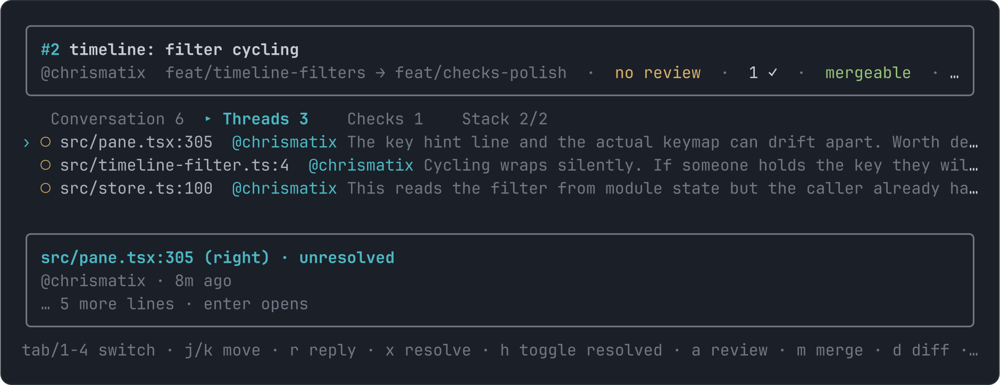
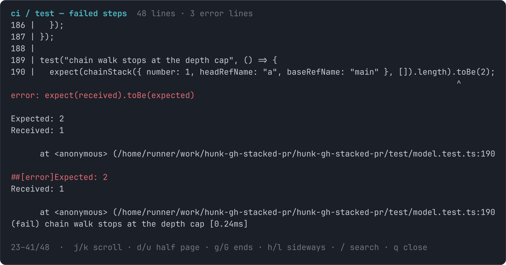

# gh-pry

Pry open one GitHub pull request in the terminal. Conversation, review threads and CI checks in a single screen; reply, resolve, review and merge without leaving it; read failed CI logs in place; open the diff in [hunk](https://hunk.dev) with one key.

```bash
gh extension install chrismatix/gh-pry
gh pry          # the current branch's PR
gh pry 123      # PR #123 in this repo
```



Press `enter` on a failed check to read its log, grouped by step with the errors in red. The same viewer opens long comments and whole threads.



## Keys

| Key | Action |
| --- | --- |
| `tab`, `1`–`4` | Conversation / Threads / Checks / Stack |
| `j` `k`, `g` `G` | move; the preview follows |
| `enter` | open the selected item; on Checks, its job log |
| `r` `x` `h` | reply / resolve / show hidden resolved |
| `c` `a` `m` | comment / review / merge |
| `u` | rerun failed checks |
| `[` `]` | previous / next PR in the stack |
| `d` `R` `q` | diff in hunk / refresh / quit |

In the log viewer: `j` `k` `d` `u` `g` `G` to move, `h` `l` sideways, `/` then `n` `N` to search, `q` to close.

## Stacks

When the PR sits in a chain, a Stack tab lists the whole chain with each PR's checks and review state. `enter` switches to it in place. The chain comes from base-ref links between open PRs, and from `gh stack view` when that extension tracks the branches.

## Requires

An authenticated [`gh`](https://cli.github.com), and `hunk` on your PATH for the diff key. Reads are one `gh api graphql` call; writes go through `gh`.

## Develop

```bash
bun install && bun run typecheck && bun test
bun run src/cli.tsx 123
```
